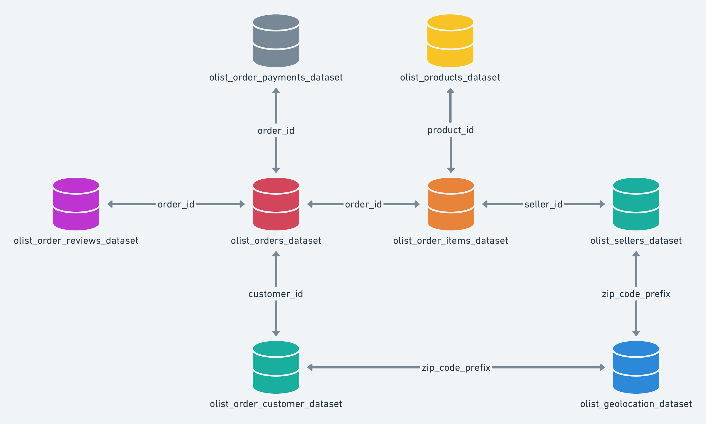
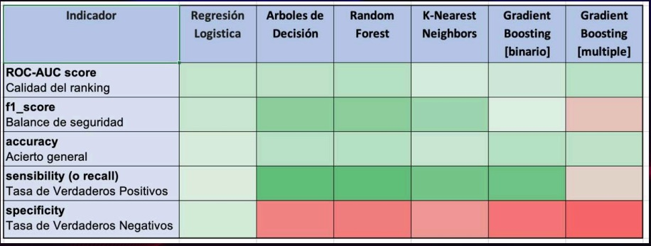
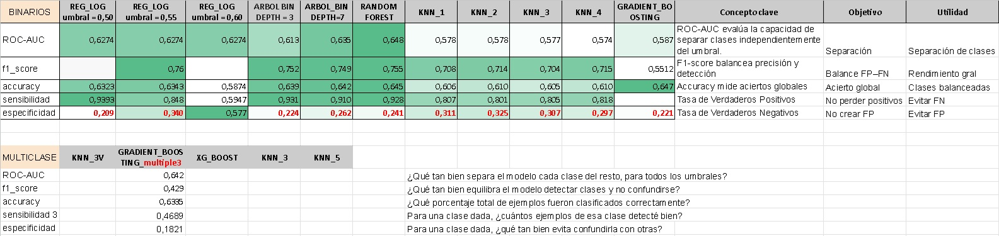
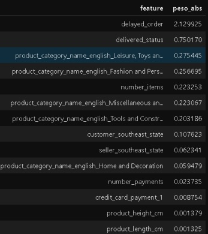
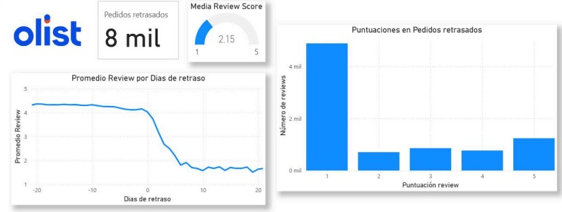
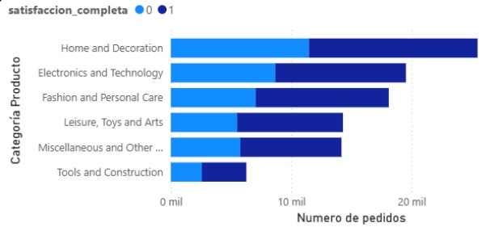
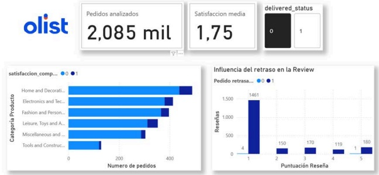
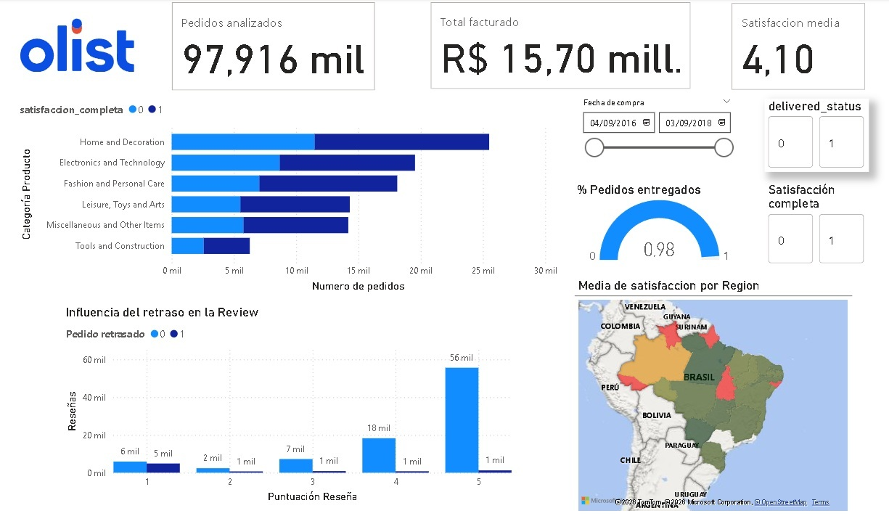
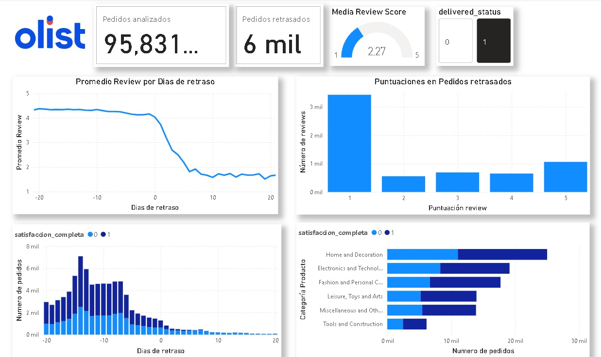

# Customer Satisfaction Prediction – Olist E-commerce

Machine Learning project to predict customer satisfaction in e-commerce using real Olist data. Helps identify at-risk customers and generate actionable insights to improve retention.  

---

## 🔹 Executive Summary

- **Dataset:** ~100k real Olist orders  
- **Objective:** Classify satisfied vs. dissatisfied customers  
- **Evaluated Models:** Logistic Regression, KNN, Decision Tree, Gradient Boosting, XGBoost  
- **Best Model:** Logistic Regression  
- **Key Insight:** Delivery delay is the main predictor of dissatisfaction  
- **Business Value:** Early identification of dissatisfied customers to improve retention  

---

## 🔹 Project Objectives

1. Identify factors affecting customer satisfaction  
2. Build and evaluate classification models  
3. Compare different Machine Learning approaches  
4. Translate technical results into business decisions  

---

## 🔹 Business Problem

In e-commerce, customer satisfaction directly impacts:

- Retention  
- Brand reputation  
- Operational costs (returns, support)

This project aims to anticipate dissatisfied customers before they leave negative feedback, enabling proactive actions such as:

- Monitoring critical orders  
- Prioritizing logistics  
- Customer service interventions  

---

## 🔹 Contribution

This project was developed collaboratively.  

**My main contributions include:**

- Development of the data preparation (ETL) pipeline  
- Exploratory Data Analysis (EDA) and data quality validation  
- Implementation and evaluation of Machine Learning models (GradientBoosting, XGBoost, KNN with multiple variables)  
- Final model selection and tuning (Logistic Regression)  
- Generation of business-oriented insights (consensual with all participants)  

### Authors

- Jacinto Arjona  
- Giada Ceresa  
- Carla López  
- Natalia Martinez  

---

## 🔹 Dataset

- **Source:** [Olist Brazilian E-Commerce Dataset (Kaggle)](https://www.kaggle.com/olistbr/brazilian-ecommerce)  
- **Data Type:** Real transactional data  
- **Target Variable:** `satisfaction` (binary)  
- **Key Features:** customer ratings, delivery time, order characteristics, seller information  

  

---

## 🔹 Technologies Used

- **Languages & Libraries:** Python (Pandas, NumPy, Scikit-learn), Matplotlib, Seaborn  
- **Visualization Tools:** Power BI, Excel  
- **Documentation & Version Control:** Jupyter Notebooks, Git & GitHub  

---

## 🔹 Project Structure

- 01_ETL/ # Data preparation and cleaning  
- 02_EDA/ # Exploratory Data Analysis  
- 03_ML_MODELS/ # ML models  
- 04_IMAGES/ # Graphs and images for README and dashboard  
- 05_DOCS/ # Documentation and final reports  

---

## 🔹 Key Notebooks

- [01_data_preparation.ipynb](01_ETL/01_data_preparation.ipynb)  
- [01_data_for_dashboard.ipynb](01_ETL/01_data_for_dashboard.ipynb)  
- [02_eda_general_analysis.ipynb](02_EDA/02_eda_general_analysis.ipynb)  
- [02_eda_feature_distributions.ipynb](02_EDA/02_eda_feature_distributions.ipynb)  
- [03_model_logistic_regression.ipynb](03_ML_MODELS/03_model_logistic_regression.ipynb)  
- [03_model_knn_baseline.ipynb](03_ML_MODELS/03_model_knn_baseline.ipynb)  
- [03_model_decision_tree.ipynb](03_ML_MODELS/03_model_decision_tree.ipynb)  
- [03_model_xgboost.ipynb](03_ML_MODELS/03_model_xgboost.ipynb)  

---

## 🔹 Data Preparation (ETL)

- Cleaned and merged transactional datasets  
- Handled missing values and outliers  
- Generated final dataset ready for analysis and modeling  

  

---

## 🔹 Exploratory Data Analysis (EDA)

- Distribution of the target variable  
- Correlations and relationships between features  
- Data quality validation  
 
  

---

## 🔹 Modeling and Evaluation

### Metrics Used

- Accuracy  
- Recall  
- Specificity (key to avoid false positives)  
- F1-score  
- ROC-AUC  

### Final Model: Logistic Regression

- Best balance across metrics  
- High **specificity** → reduces false positives (satisfied customers classified as dissatisfied)  

  
  

---

### Final Model Results

- Accuracy: 0.587  
- Recall: 0.594  
- Specificity: 0.577  
- ROC-AUC: 0.6274  

The model prioritizes minimizing false positives, aligned with business objectives.  

---

## 🔹 Key Insights

- Delivery delays → main driver of dissatisfaction  
- Ratings heavily skewed toward high values (dataset is imbalanced)  
- Features like price or category have lower impact compared to logistic-related features, especially delivery time  
- Failed deliveries correlate with negative ratings  

  
  
  
  

---

## 🔹 Power BI Visualization

- **General Dashboard:** overall business view  
- **Delay Dashboard:** detailed analysis of late deliveries  

  
  

---

## 🔹 Limitations

- Imbalanced dataset (predominantly positive ratings)  
- No textual information (customer reviews) was used  
- Limited depth of available features  
- Potential improvement using NLP  

---

## 🔹 Future Improvements

- Incorporate text analysis (NLP) and semantic embeddings  
- Hyperparameter optimization  
- Balancing techniques (e.g., SMOTE)  
- Automated training pipeline  

---

## 🔹 How to Install the Project

First, clone the repository and then install dependencies via pip:

```bash
git clone https://github.com/JotaArj/customer-satisfaction-logistic-regression.git
cd customer-satisfaction-logistic-regression
pip install -r requirements.txt
```

- Download the dataset from [Kaggle](https://www.kaggle.com/datasets/olistbr/brazilian-ecommerce/data)
- Extract it in the project root, creating the folder /db/raw/

## 🔹 Project Execution

1. Run the data pipeline:

- `01_ETL/01_data_preparation.ipynb`
- `01_ETL/01_data_for_dashboard.ipynb`

2. Exploratory analysis (optional):

- `02_EDA/02_eda_general_analysis.py`
- `02_EDA/02_eda_feature_distributions.py`

3. Modeling:

- `03_ML_MODELS/03_model_logistic_regression.ipynb`
